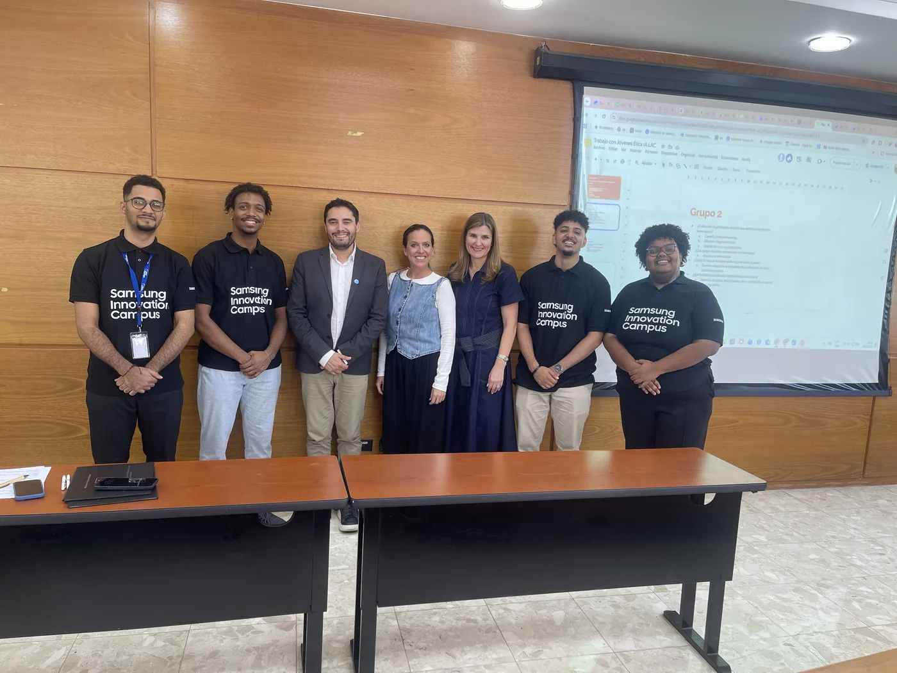

  

<h2 align="center">👋 Hi, I'm José M. Taveras</h2>

  Tech enthusiast from <b>La Romana, Dominican Republic</b> 🇩🇴 
  <b>Software Development · DevOps · Linux</b> — always learning, always exploring. 🚀

  
  
  

---

## 💻 Tech Stack

| **Languages** | **DevOps & Infrastructure** |
|---|---|
|    |    |
|  |    |

| **Data & AI/ML** | **Web & Frameworks** |
|---|---|
|    |    |
|   |    |

| **Linux & Tools** | **Testing** |
|---|---|
|    |   |
|  |  |

---

## 🏆 GitHub Stats

  
  

  

---

## 🌐 About Me

I'm pursuing a career in **software engineering with a DevOps focus** — bridging development and infrastructure to ship scalable products. I'm a verified specialist in **computer vision and AI** through the Samsung Innovation Campus (SIC) program, and I lead bilingual tech communities.

- 🎓 **Samsung Innovation Campus**: AI & Python (240h) — capstone *Via Libre RD* presented at the **UNESCO**-backed Summit on AI Ethics (LATAM & Caribbean).
- 🧑‍🏫 Passionate about teaching and sharing knowledge with the community.
- 🐧 Arch Linux power user, declarative environments (Hyprland, Neovim, tmux).

  

---

### ✍️ Random Dev Quote

> [!NOTE]
> **Open to:** Collaboration, Research Internships, Technology Discussions, Contributing to Open Source Projects

> [!IMPORTANT]
> Connect with me for more information through my [LinkedIn](https://www.linkedin.com/in/jose-m-taveras-reyes/)
