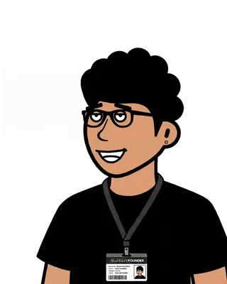
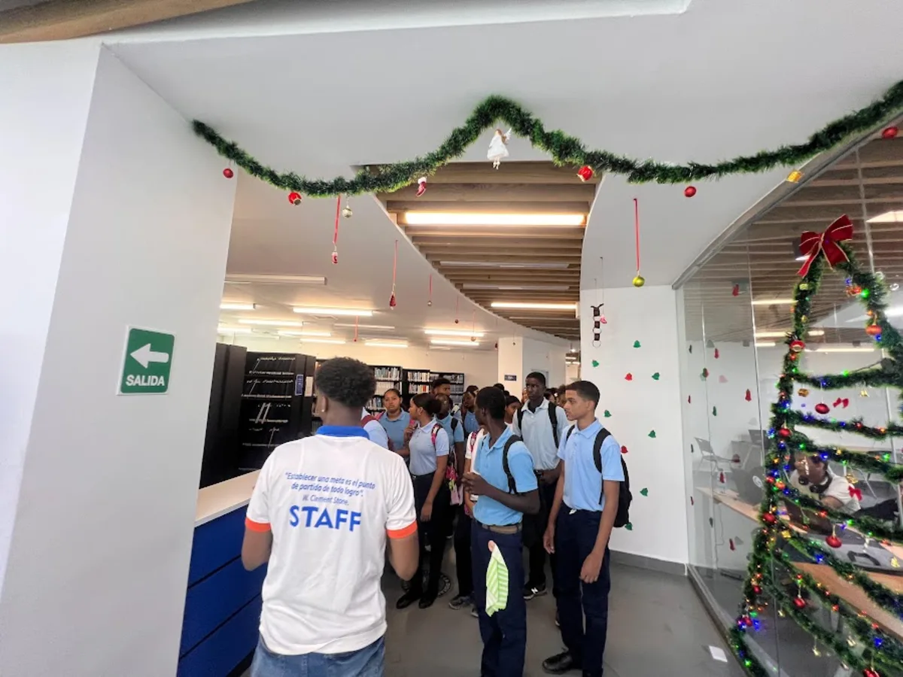

<p align="center">
  
</p>

<h2 align="center">👋 Hi, I'm José M. Taveras</h2>

<p align="center">
  Tech enthusiast from <b>La Romana, Dominican Republic</b> 🇩🇴<br/>
  🐧 Linux lover &mdash; always learning, always exploring. 🚀
</p>

---

## About Me

I'm actively pursuing new knowledge and practical skills in technology, with a strong focus on **software development**, **DevOps**, and **Linux**. I love building things end-to-end and sharing what I learn along the way.



### Soft Skills

```python
soft_skills = {
    'Languages': {
        'Spanish': 'Native',
        'English': 'Intermediate (Conversational)'
    },
    'Collaboration & Adaptability': [
        'Collaborative team player',
        'Adaptable across diverse fields'
    ],
    'Learning & Motivation': [
        'Strong commitment to learning new technologies',
        'Highly motivated with strong work ethic'
    ],
    'Time Management & Prioritization': [
        'Effective time management',
        'Prioritization skills'
    ]
}
```

---

## Tools & Technologies

<p align="center">
  
</p>

> [!NOTE]
> **Open to:** Collaboration, Research Internships, Technology Discussions, Contributing to Open Source Projects

> [!IMPORTANT]
> Connect with me for more information through my [LinkedIn](https://www.linkedin.com/in/jose-m-taveras-49b0172b1/)
